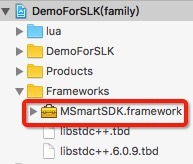
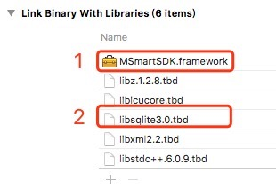
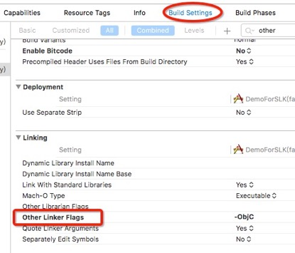
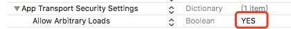

## User Manual of MideaSDK for iOS

### 1、Use "MSmartSDK.framework" to your project：

#### 1.1 Manual management "MSmartSDK.framework" to your project

##### 1.1.1 Import the package "MSmartSDK.framework" to your project.

<div  align="center">

</div>

##### 1.1.2 Import the required library.

<div  align="center">

</div>
*Note："MSmartSDK.framework" must be placed before "libsqlite3.tbd"*

##### 1.1.3 In the menu "TARGETS-->Build Settings", set the parameter "Other Linker Flags" to "-all\_load" or "-ObjC"  or "–fore_load (path or SDK package)".

<div  align="center">

</div>

#### 1.2 Cocoapods management

MSmartSDK is available through [CocoaPods](http://cocoapods.org/). To install it, simply add the following line to your Podfile:

```ruby
pod 'MSmartSDK'
```


### 2、Configure the "App Transport Security（ATS）" in the "info.list" of the project，

<div  align="center">

</div>

### 3、 Import this header file in any object which using the MideaSDK APIs.    

```objective-c
#import <MSmartSDK/MSmartSDK.h>
```

### 4、The initial API of MideaSDK must be the first called one if you intend to use the MideaSDK.

```objective-c
/*!
 * The initial API of MideaSDK must be the first called one if you intend to use the MideaSDK.
 *
 *
 * @param appID   - AppID,AppKey and AppSrc are assigned by Midea.
 * @param appKey  - 
 * @param appSrc  - 
 * @param mode    - the running mode of SDK
 *
 * @param completion - Async ACK(block)
 * "error" is the the result of this API. 
 * "error.code" contain:
 * 0     Succeed
 * >0    Failed. Detailed info is defined in "MSmartErrorCode" or "error.localizedDescription"
 *
 **/
- (void)initSDKWithAppID:(NSString*)appID
                  appKey:(NSString*)appKey
                  appSrc:(NSInteger)appSrc
                workMode:(MSmartWorkMode)mode
              completion:(void (^)(NSError* error))completion;
```

the parameter "workMode" is used to select a running mode, there are two modes you can select：

```objective-c
typedef NS_ENUM (NSInteger, MSmartWorkMode)
{
    MSmartWorkModeFamily = 0,//Home Group mode
    MSmartWorkModeFriend = 1,//Single User mode
};
```

For example：

```objective-c
[[MSmartSystemManager sharedManager] initSDKWithAppID:AppID
                        appKey:AppKey
                        appSrc:AppSrc
                       workMode:MSmartWorkModeFamily
                    completion:^(NSError *error) {
                       [MSTools printError:error];
                    }];
```

### 5、Select the environment of server: Product / Develop：

```objective-c
/**
 *  modify the environment
 *
 *  @param serverAddress: type of server
 *
 *  @return: true of false.
 */
- (BOOL)setupServerAddress:(MSmartServer)serverAddress;
```

There are four different server types.：

```objective-c
typedef NS_ENUM (NSInteger, MSmartServer) {
    MSmartServerDevelopment        = 0,//Develop server within China
    MSmartServerProduction         = 1,//Product server within China
    MSmartServerOverseaDevelopment = 2,//Develop server beyond China
    MSmartServerOverseaProduction  = 3,//Product server beyond China
};
```

For example：

```objective-c
[[MSmartSystemManager sharedManager] setupServerAddress:MSmartServerProduction];
```

### 6、The options of SSL security channel：

```objective-c
/**
 *  Open the HTTPS mode. HTTP mode is using by default.
 *
 *  @param open - 
 */
- (void)openHttpsChanel:(BOOL)open;
```

### 7、How to configure and control a new appliance by APP(iOS).

Configure and control are the basic feartures of smart appliance.

#### 7.1 Register a new account and login

Firstly, you need to register a account with email. You will receive an activation email send from Midea once register succeed. You can activate your account following the guide in the email. This is the API for registeration.	

```objective-c
//register an account with email
- (void)registerWithEmail:(NSString *)email
                 password:(NSString *)password
				 nickName:(NSString *)nickName
			   completion:(void ( ^ ) ( NSError *error ))completion
```

*Note: We can set that the registered account is activated by default.(no need to activate from email)*

This is the API for login. You need to call the login API before any other API.

```objective-c
// login with email
- (void)loginWithEmail:(NSString *)email
              password:(NSString *)password
            completion:(void ( ^ ) ( NSError *error ))completion
```

#### 7.2 Configure a new appliance(iOS)

Configure a new appliance means to make it connect to WiFi network and bind with your account.There are two mode can be used to configure the Midea Smart Appliances.

**AP Mode:**

AP Step 1. Reset the appliance to AP configure mode. You can find a wifi name like mideaXXXXXX in thewifi list in settings.

AP Step 2. Connect your iPhone to that WiFi.(Default password is "12345678")

AP Step 3. Call this api to ask SDK connect to your appliance:

```objective-c
- (void)connectDeviceWithSSID:(NSString *)ssid
                   completion:(void ( ^ ) ( NSError *error ))completion
```

AP Step 4. Write Router info and try to bind and activate the appliance.   	

```objective-c
- (void)bindDeviceWithWifi:(NSString)homeSSID
				  password:(NSString)password
				 WiFiBSsid:(NSString )bssid
				deviceName:(NSString)deviceName
				       tsn:(NSString )tsn
		        completion:(void (^)(NSError error, NSDictionary *dict))completion;
```

This API will send the wifi name and password of your home router to appliance. It will set the appliace running into STA mode. This API will bind and activate the appliance if the appliance connect to router and register in cloud server.

**MSC(Midea Smart Config) mode:**

In this mode, you can configure the appliance directly. No need to manually connect iPhone to the appliance.

MSC Step 1. Reset the appliance to MSC mode.

MSC Step 2  Call this API to start the configuration.

```objective-c
- (void)startSendMSCWithDeviceType:(NSString *)deviceType 
                          homeSSID:(NSString *)homeSSID 
                          password:(NSString *)password 
                               tsn:(NSString *)tsn 
                         extension:(NSString *)extension 
                               key:(NSString *)key 
                        completion:(void(^)(NSError *err,NSDictionary *dict))completion
```

You can find mode info in the maunal. You can also use the SDK API "getConfigureTypeByQrcode" to find the mode in the QRCode on the appliance.

#### 7.3 Control the smart appliance(iOS)

You can control the smart appliance in your mobile application by these steps:

Step 1. Login(login with SDK)

Step 2. Get appliance list belong to the account.

```objective-c
// Get device list added to SDK.
- (void)getDeviceInfoArray:(void(^)(NSError *error,NSArray *deviceList))completion
```

The device list contains device information: 

|     ITEM      |          Description           |
| :-----------: | :----------------------------: |
|   deviceId    |     ID assigned by server      |
|  deviceName   |   device Name modify by user   |
|   deviceSn    |           device sn            |
|  deviceSsid   |  SSID of appliance in AP mode  |
|  deviceType   |    device type, such as EA     |
| deviceSubType |            SubType             |
|  isActivity   | The device is activited or not |
|  bindUserId   |     ID of the device owner     |
|  isWanOnline  |    online status in server     |
|  isLanOnline  | online status in local network |

Step 3. Send commands to Appliances

```objective-c
//Send query or control commands to appliance.
- (void)sendDataWithDeviceID:(NSString *)_deviceID 
                   tempArray:(NSArray *)tempArray 
                         tag:(int)tag
```

*Note: You need to package the query and control commands to binary string following the protocol of different appliance type.*

You also need to parse the binary string in the API Callback using the same protocol.

The specific protocol you can obtain from your BD.

### 8、The SDK features of iOS and Android is almost the same. This document is for iOS use only. The APIs are different on Android platform due to the system limitation.


[ChangeLog](./ChangeLog.md) 

[Interface documentation](http://htmlpreview.github.io/?https://github.com/midea-sdk-org/ios-sdk/blob/master/html/index.html)